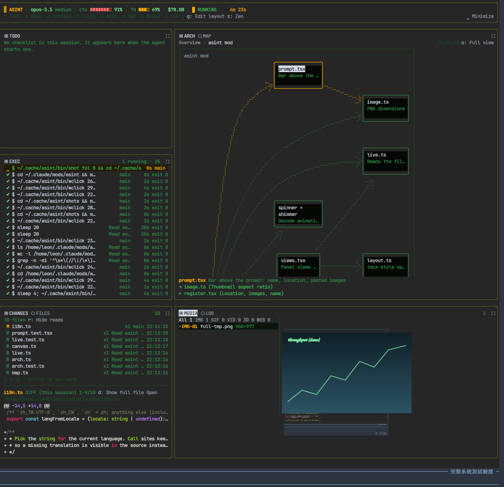
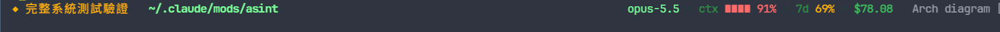
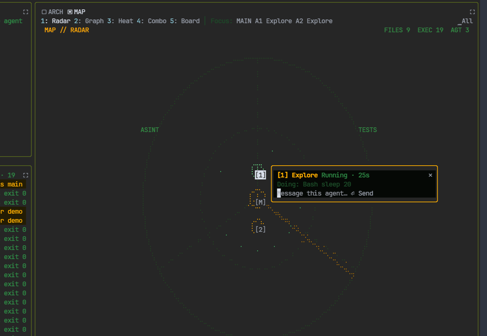
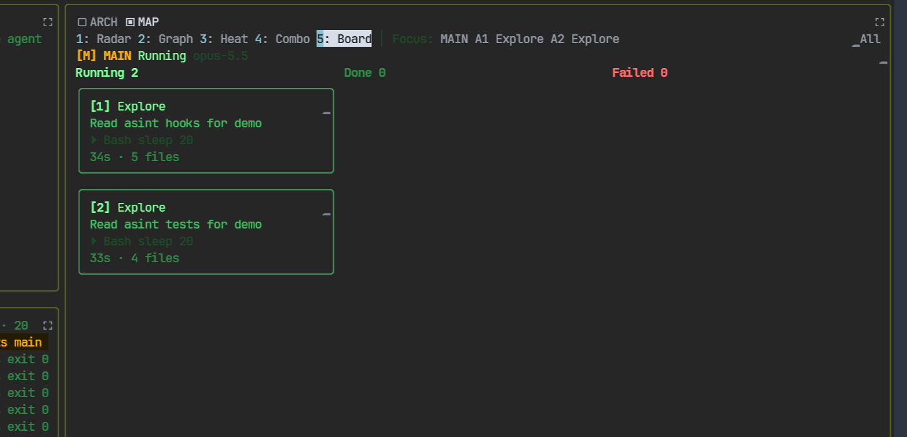
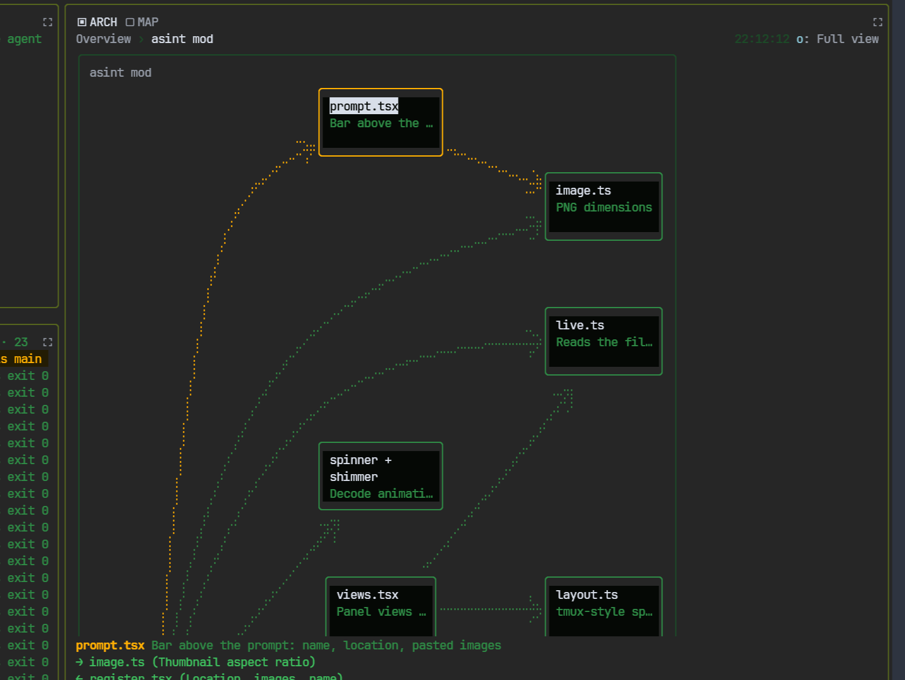

# asint

A dashboard for Claude Code that lives in the terminal next to the conversation. It shows what the session is doing while it does it: the checklist, every shell command and its output, the files touched with their diffs, the whole project tree with live previews, a radar of the main agent and its subagents that you can click to give them instructions, and the project's architecture as a clickable diagram.



asint is a Claude Code mod (a plugin built on function hooks). It needs Claude Code 2.1.291 or newer and a terminal with the kitty graphics protocol (kitty or Ghostty) for images.

## Install

```
/plugin marketplace add leonrlr4/asint
/plugin install asint@asint
```

The dashboard opens by itself when a session starts and the terminal is at least 144 columns wide. Type `/asint` to open it on a narrower terminal.

## What you get

### The prompt bar



One line above the prompt: the session's name, the git repository and branch (red on `main`, `master` and `prod`), the number of uncommitted files, the current directory, and the model, context use, rate limits and cost. The turn timer stays on the spinner line, so nothing is shown twice. Images you paste appear as thumbnails before you send them, and larger under your message after. **Plain** asks Claude, as a side question that does not interrupt the turn, to explain its last reply for a beginner. **Arch diagram** asks it to check the project's architecture diagram and create one if there is none.

### Panels

| Panel | Shows |
|---|---|
| STATUS | Model, context, rate limits, cost, turn timer, checklist progress |
| TODO | The agent's checklist with start times and durations |
| EXEC | Every Bash command from the main agent and subagents, live output for background ones, the error line of failed ones |
| CHANGES | Files this session read, edited or created, with the session's diff for each |
| FILES | The whole project tree. Follow mode jumps to the file the agent is editing and shows the new text as it streams in |
| ARCH | The project's LikeC4 architecture diagram, clickable |
| MAP | Radar, graph, heat map, combined and board views of agents and files |
| MEDIA | Images, GIFs, videos, 3D models and web pages the session produced |
| LOG | Every other tool call, permission check and agent event |

Drag the layout into any shape with `g`; each cell can stack several panels as tabs. `⛶` (or `z`) makes one panel fill the dashboard, and **▁ Minimize** folds the dashboard away and keeps the prompt bar.

### Live edits

asint reads the model's tool calls while they stream. When Claude starts an Edit or Write, FILES jumps to that file, marks it `✎`, and shows the replaced lines struck through in red and the new text growing in green with a cursor. When the tool finishes, the changed lines stay highlighted for a few seconds.

### Talk to any agent



Click `[M]` or a subagent's `[n]` on the radar or the graph, type an instruction, press Enter. Messages to the main agent are queued like anything you type; messages to a subagent reach it at its next step, and a finished subagent is woken up with the message. **✉ All** sends one instruction to every running subagent. The board view lists agents in Running, Done and Failed columns.



### Architecture you can click



ARCH reads `docs/*.c4` at the root of the current git repository. Click a box to see what it talks to; click a box marked `▸` again to open the view inside it. In a workspace that holds several repositories, asint also finds a system map in `*/02-Architecture/system-maps/*.c4`: elements there carry `metadata { repo '<path>' }`, and opening one switches to that repository's own diagram, with a breadcrumb to go back up. `o` opens the full LikeC4 viewer in your browser for zoom and pan. When the system map lives in an Obsidian vault, asint writes a Mermaid copy of each view into `views/` so Obsidian can draw it.

asint adds a short rule to Claude's system prompt whenever a diagram exists: when a change alters the architecture, Claude updates the diagram in the same turn. Nobody else decides whether the diagram needs changing.

### Output stays in the terminal

asint asks Claude to write plans and reports as Markdown in its reply rather than as Claude Docs documents. When Claude publishes an HTML page as an Artifact, asint opens the local file in [terminal-browser](https://github.com/zenbu-labs/terminal-browser) next to the conversation (or your default browser if it is not installed) and lists it under MEDIA. `/html <path or url>` does the same by hand; `/html -b` uses the system browser.

### Looks

Colors follow the current [Omarchy](https://omarchy.org) theme and switch when you change it. `/skin hacker` switches to a phosphor-green look.

## Commands

| Command | Does |
|---|---|
| `/asint` | Open the dashboard |
| `/asint edit` | Edit the layout |
| `/asint reset` | Restore the default layout |
| `/asint arch` | Ask Claude to check or create the architecture diagram |
| `/asint lang zh\|en\|auto` | Interface language; `auto` follows your system locale |
| `/skin [omarchy\|hacker]` | Switch the color scheme |
| `/html [-b] <path or url>` | Open a page in terminal-browser, or the system browser with `-b` |

## Requirements

- Claude Code 2.1.291 or newer.
- kitty or Ghostty for images in MEDIA, the prompt bar and file previews.
- [LikeC4](https://likec4.dev) for ARCH. asint uses `likec4` from `PATH`, or `ASINT_LIKEC4` if set, and falls back to `npx likec4`.
- ImageMagick and ffmpeg for media previews.
- Optional: terminal-browser for opening pages next to the conversation; Omarchy for theme colors.

The interface is English, or Traditional Chinese when your locale is Chinese.

## License

MIT
